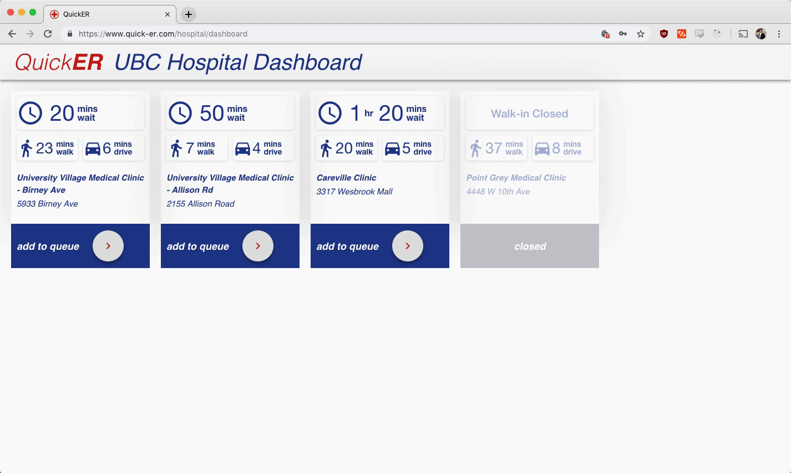

 

## Overview

One of the most pressing issues facing public healthcare systems is the overcrowding of emergency rooms. According to the Canadian Institute for Health Information, ninety percent of B.C. emergency room (ER) visits were completed after 8.4 hours in 2016-17. Additionally, over 40% of these visits consisted of patients that were non-urgent, meaning they could have recieved adequate care at a walk-in clinic. The issue lies in the fact that individuals with non-critical conditions are turning to the ER instead of going to a non-emergency facility such as a walk-in clinic. Not only does this saturate all of the hospitals resources and overburden the emergency room staff, but the non-critical individuals are also forced to wait exceedingly long times to be treated due to their low priority assessment. 

QuickER is a software that works to solve this problem by allowing triage staff at hospitals to redirect non-critical patients to less crowded walk-in clinics nearby. Thus the number of low priority patients in ERs will decrease, the number of patients at clinics will increase and the overall wait time for patients will be reduced. 

## Demo

As a hospital user, you can view all the nearby walk-in clinics and their live wait times and commute times. You can then choose to forward the patient to a specified clinic.

As a clinic, you recieve a notifaction when a new patient has been added to the clinic queue. You can then accept the request, and later check-in the patient once they have arrived.

When a patient is redirected using the system, they recieve updates sent to their mobile phone.
 

